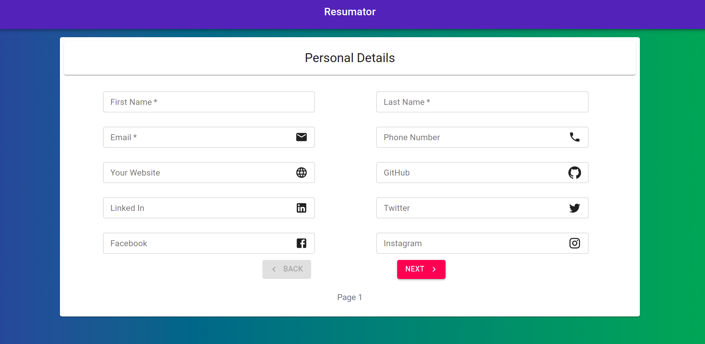

# Resumator

1. **React** for Frontend
2. **Express** as Middleware.
3. **Material UI** 
4. **React-Bootstrap** for styling.
5. <3

# Introduction
Via Resumator, we  created a web application that gives the users the freedom and ease to make their own resume just by entering the details in sort of stylized forms. The user would enter the various sets of details one by one and get the resume.

.

## Setup

Clone the repository:
```
https://github.com/ceyxasm/resumator.git
```

Change the working directory
```
cd resumator
```

Install dependencies for server
```
npm install
```

Install dependencies for client
```
cd client && npm install
```

Run the client & server with concurrently
```
cd .. && npm run client
```

Open new terminal
```
npm run server
```


Server runs on http://localhost:5000 and client on http://localhost:3000


